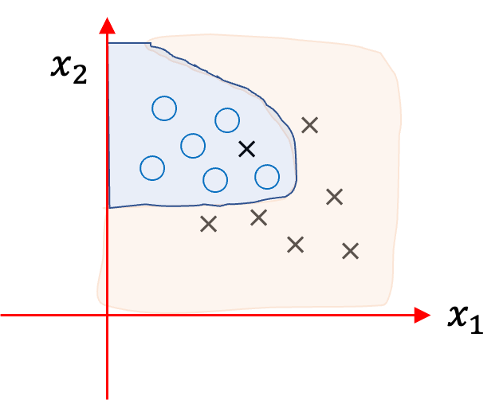

## Welcome to ML Journey
I will post my studies of ML. Maybe you will also learn something from these posts.

## Supervised Learning
Supervised learning can be thought of as curve fitting where you get f(x) that is in some sense optimal predictor of y. Another useful interpretation is statistical since we are really using observed data for optimization. In this view each datapoint $(x,y)$ is a sample from some unknown joint probability distribution, $p(x,y)$. The process of the data collection can be used to guess a probability function for this with unknown parameters, say $p(x,y; \theta)$. Then optimized values of parameters are determined by applying the principle of maximum likelihood of the observed $N$ datapoints in the dataset. When we use Bayesian approach, there is a corresponding optimization principle.

Assuming each datapoint is identically and independently sampled (observed/measured), the joint probability of the observed data will just be a product

$$ P_D = \Pi_{i=1}^{N} P(x^{(i)}, y^{(i)}; \theta). $$

